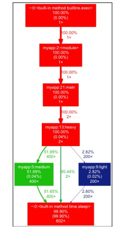

# Unleashing Python’s Power: Profiling and Visualization with cProfile
In the realm of Python programming, performance optimization is a critical aspect, particularly when dealing with large-scale applications or data-intensive processes.Profiling is a process that helps us understand the runtime behavior of a program, such as the execution time of a function or memory usage.  It is crucial for identifying bottlenecks and optimizing  performance of the code.

## cProfile
Python offers several tools for time profiling, notably profile and cProfile. Both tools provide the same basic functionality. While profile is a pure Python module, cProfile is implemented in C, offering a similar interface but with reduced overhead. This makes cProfile the preferred choice for most Python developers. 

To illustrate their usage, let's consider a Python script, myapp.py, containing various functions with different execution times:

```python
import time

def medium():
    time.sleep(0.01)

def light():
    time.sleep(0.001)

def heavy():
    for _ in range(100):
        light()
        medium()
        medium()
    time.sleep(2)

def main():
    for _ in range(2):
        heavy()

if __name__ == '__main__':
    main()
```
When myapp.py is profiled using cProfile, the profiler provides a detailed report of function calls and execution times. You can either invoke it directly from the command line or integrate profiling into your script.

**Use Command-Line**
```shell
$ python3 -m cProfile myapp.py
```
**Call from Python Code**
```python 
import cProfile
from myapp import main

cProfile.runcall(main)
profiler.print_stats()
```


This generates an output summarizing the number of calls (ncalls), total time spent in the function (tottime), time per call (percall), cumulative time (cumtime), and the specific lines in the script where these functions are defined. For example:

```shell

ncalls  tottime  percall  cumtime  percall  filename:lineno(function)
    2    0.001   0.000    8.243    4.121    myapp.py:13(heavy)
  400    0.001   0.000    4.026    0.010    myapp.py:5(medium)
  200    0.000   0.000    0.212    0.001    myapp.py:9(light)
```
This output is valuable for understanding which parts of the code consume the most time. For instance, if a function has a high cumtime but low tottime, it suggests that the time is primarily spent in the functions it calls.


## Understanding pstats Fields
When you profile a Python program using cProfile, the output can be analyzed using the pstats module, which provides a structured view of the profiling data. Understanding the key fields in the output is crucial for interpreting the results and identifying performance bottlenecks. Here's a breakdown of the primary fields:

1. ncalls: This shows the number of calls to the function. If this number is split into two (e.g., 3/1), it means that the function was called 3 times, but only once was it a non-recursive call (direct call).

2. tottime: This is the total time spent in the function, excluding time spent in calls to sub-functions. It represents the exclusive time that the function took to execute, giving you an idea of functions that are inherently slow.

3. percall (first instance): This is the quotient of tottime divided by ncalls. It represents the average time per call in the function itself, excluding time in sub-functions.

4. cumtime: This is the cumulative time spent in the function and all sub-functions it might call. It's a measure of the function's total impact on the runtime, including the functions it calls.

5. percall (second instance): This is the quotient of cumtime divided by the primitive calls. It shows the average time per call, including both the time in the function itself and in all its sub-function calls.

## Analyzing Profiling Data with pstats
The pstats module provides several ways to sort and analyze the profiling data from cProfile. Here's how to effectively use it:

1. Sorting Data:

You can sort the data by any of the fields, such as ncalls, tottime, cumtime, etc. This helps in quickly finding functions that are called most frequently or take the most time.
For example, sorting by tottime helps identify functions where most of the execution time is spent, pointing towards potential areas for optimization.

```python
import pstats
import cProfile
from myapp import main

cProfile.run('main()', 'myapp.stats')
stats = pstats.Stats('myapp.stats')
stats.sort_stats('time').print_stats(3)
```
2. Focus on High Impact Functions:

Pay attention to functions with high cumtime. These are functions that, along with their sub-functions, contribute significantly to the total runtime.
Functions with a high tottime but low cumtime are usually not invoking many sub-functions and might be candidates for direct optimization.  

3. Understanding Recursive Calls:

If a function shows two numbers in ncalls (like 3/1), it indicates recursive calls. Understanding the nature of these recursive calls can sometimes reveal inefficient algorithms that could be optimized. 

4. Average Time Per Call:

The percall value is crucial for understanding the cost of each function call. A high percall value might indicate a performance bottleneck, especially if the function is called frequently. 

5. Comparative Analysis:

Compare the tottime and cumtime of different functions to understand how they contribute to the overall performance. A function with a high cumtime but low tottime indicates that it's spending most of its time in sub-functions.
6. Practical Use:

Use the print_stats method to print the sorted statistics.
Use print_callees and print_callers to understand how functions interact with each other, which can be crucial in diagnosing performance issues in complex codebases.


## Generating a Visual Profiling Graph:
gprof2dot is a Python library that transforms profiler data into a dot graph. It’s used with Graphviz, an open-source graph visualization software. Install both using PyPI and the Graphviz website respectively.

After installation, use the following command to generate a visual profiling graph:

```shell
gprof2dot -f pstats myapp.stats | dot -Tpng -o output.png
```

This command creates a PNG image, output.png, that visualizes performance bottlenecks in your code. These tools provide insights into your code’s performance and aid in writing efficient programs. 




In summary, macro-profiling with tools like cProfile and pstats in Python is instrumental in detecting and analyzing performance issues. By understanding and addressing these issues, developers can significantly enhance the efficiency and speed of their Python applications.